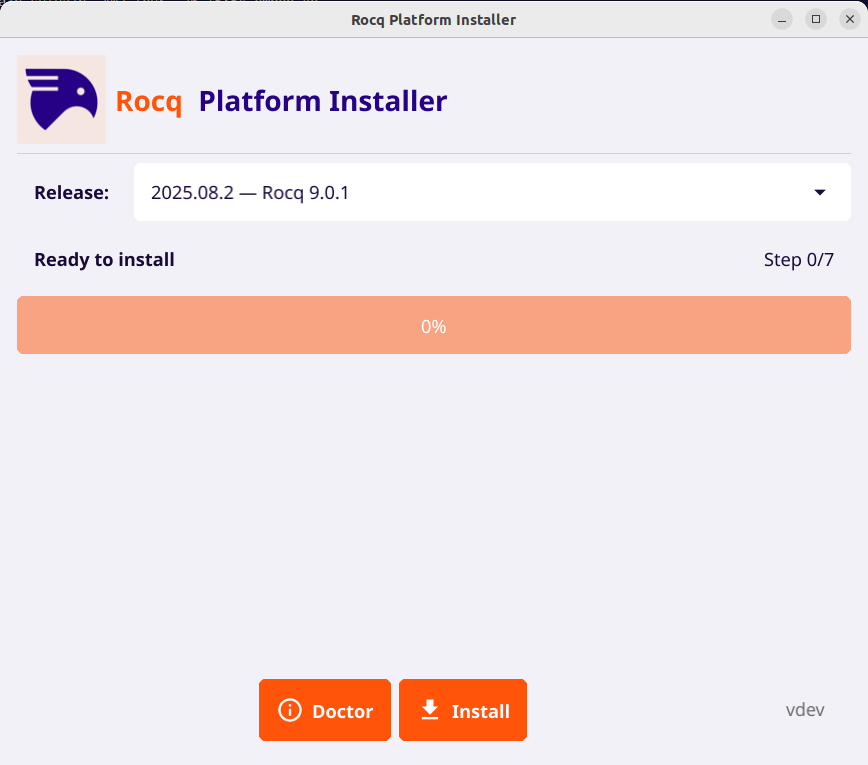
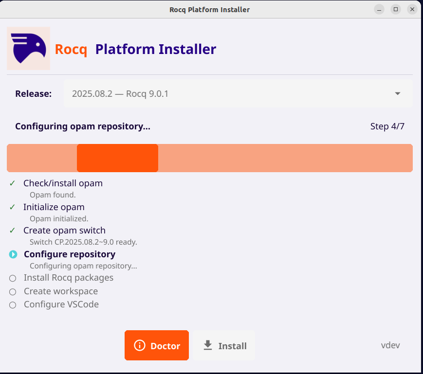
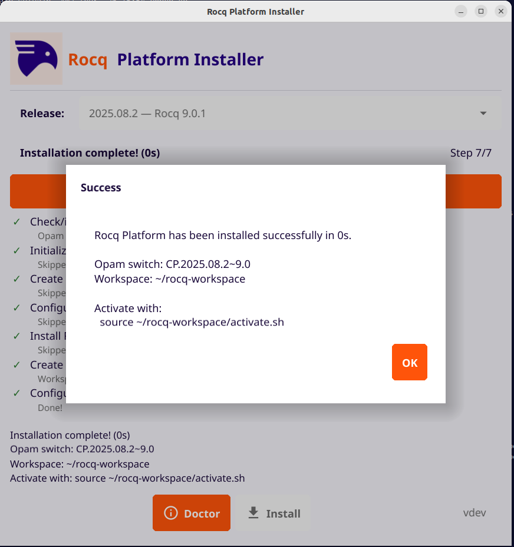
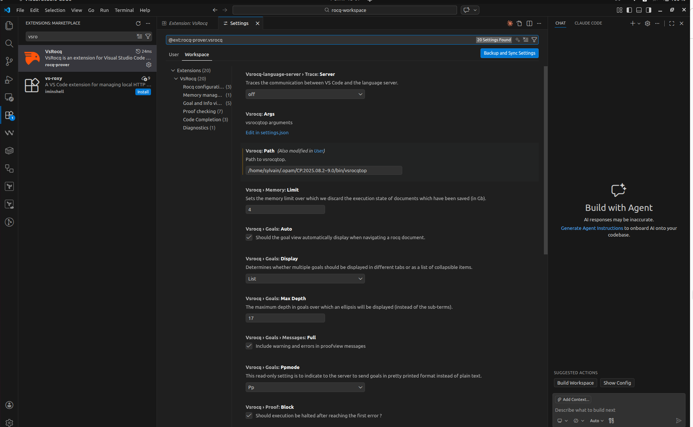
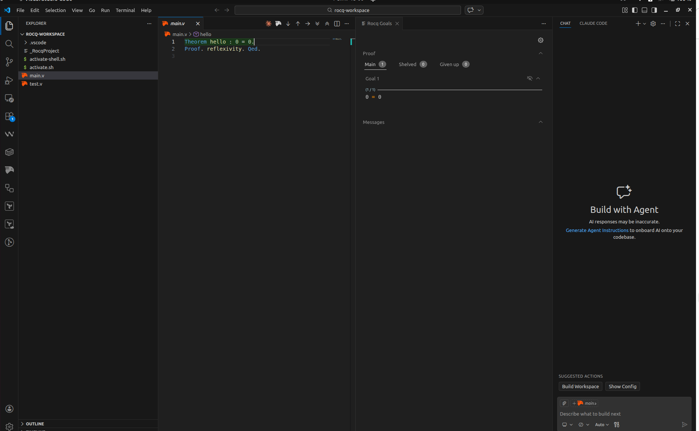

# rocq-platform-starter

Reproducible and version-pinned Rocq environment bootstrapper.

> Install and run Rocq in minutes, with a fully reproducible and version-aligned environment.

---

## Overview

rocq-platform-starter is a cross-platform tool designed to download, install, and configure
a fully reproducible Rocq (formerly Coq) environment with minimal user
interaction.

It enforces strict version alignment across the entire stack and follows
the official Rocq Platform release conventions.

The goal is to remove the complexity of manual setup while preserving
determinism and reproducibility.

---

## Demonstration

### Main interface

  

---

### Installation process

  

---

### Successful setup

  

---

### VSCode environment variables

---

### Ready-to-use environment in VSCode

---

## Key Features

- Reproducible Rocq installation
- Strict version pinning across the toolchain
- Automatic workspace generation
- VSCode integration (VSRocq / VSCoq)
- Cross-platform support (Linux, macOS, Windows)
- Deterministic and version-aligned setup

---

## Installation Requirements

### Linux

- opam ≥ 2.1
- jq
- curl
- VSCode (optional)

For GUI build:

- go ≥ 1.22
- Fyne dependencies

---

### macOS

- curl
- jq
- VSCode (optional)

---

### Windows

No prerequisites for end users.

---

## Installation

Download the appropriate release for your platform:

https://github.com/justme0606/rocq-platform-starter/releases

---

### Linux

Download:

rocq-platform-starter

Then run:

chmod +x rocq-platform-starter
./rocq-platform-starter

---

### macOS

Download:

rocq-platform-starter-macos-arm64.dmg

Then:

1. Open the DMG
2. Drag Rocq Platform Starter into Applications
3. Launch the application

---

### Windows

Download:

rocq-platform-starter-windows.exe

Then simply run the executable.

---

## What happens next

Once launched, the application:

- Installs the appropriate Rocq Platform version
- Configures the environment
- Sets up a ready-to-use workspace
- Installs and configures VSCode integration

No manual configuration is required.

---

## Supported Platforms

Linux, macOS, Windows

---

## Reproducibility Model

Driven by:

manifest/latest.json

Ensures:

- Version consistency
- Controlled dependency resolution
- Explicit release targeting

---

## Intended Audience

- Academic courses
- Research environments
- Workshops
- Student onboarding
- Reproducible setups

---

## License

MIT License

---

## Repository

https://github.com/justme0606/rocq-platform-starter
