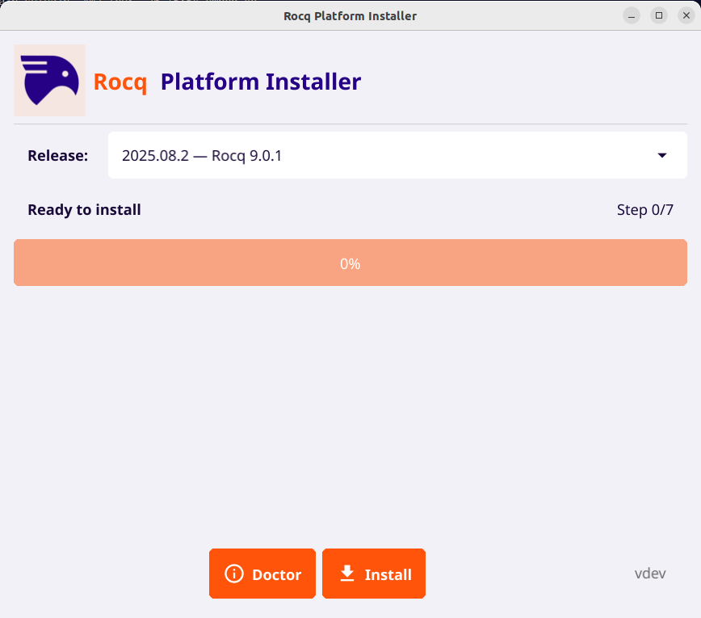
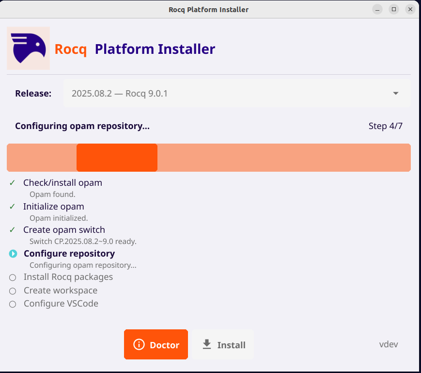
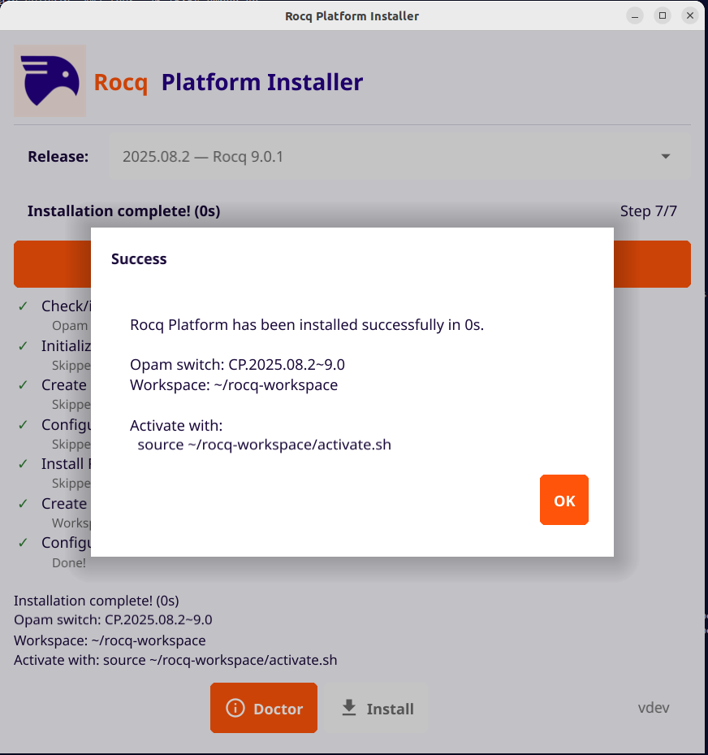
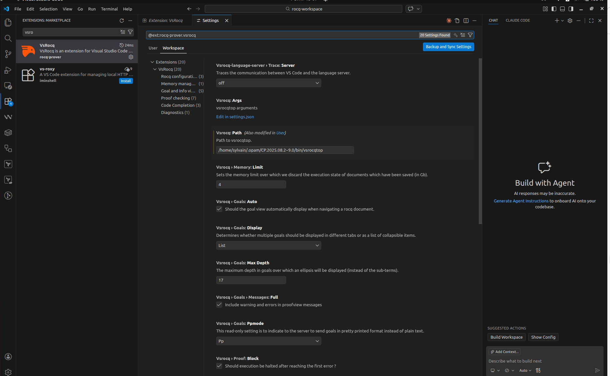
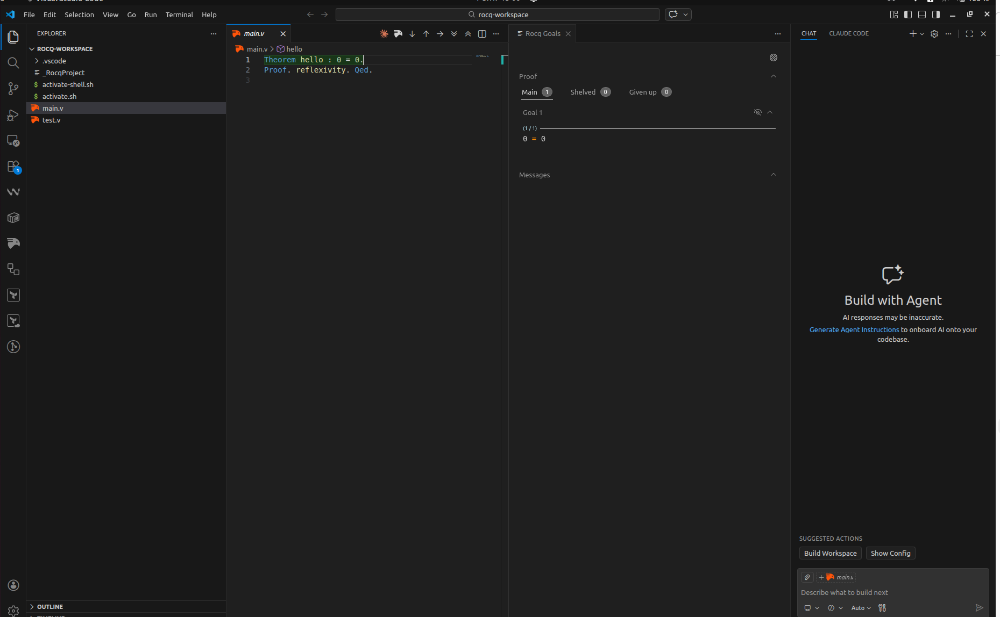

# rocq-platform-starter

Reproducible and version-pinned Rocq environment bootstrapper.

> Install and run Rocq in minutes, with a fully reproducible and version-aligned environment.

---

## Overview

rocq-platform-starter is a cross-platform tool designed to download, install, and configure
a fully reproducible Rocq (formerly Coq) environment with minimal user
interaction.

It enforces strict version alignment across the entire stack and follows
the official Rocq Platform release conventions.

The goal is to remove the complexity of manual setup while preserving
determinism and reproducibility.

---

## Demonstration

### Main interface

  

---

### Installation process

  

---

### Successful setup

  

---

### VSCode environment variables

---

### Ready-to-use environment in VSCode

---

## Key Features

- Reproducible Rocq installation
- Strict version pinning across the toolchain
- Automatic workspace generation
- VSCode integration (VSRocq / VSCoq)
- Cross-platform support (Linux, macOS, Windows)
- Deterministic and version-aligned setup

---

## Installation Requirements

### Linux

- opam ≥ 2.1
- jq
- curl
- VSCode (optional)

For GUI build:

- go ≥ 1.22
- Fyne dependencies

---

### macOS

- curl
- jq
- VSCode (optional)

---

### Windows

No prerequisites for end users.

---

## Installation

Download the appropriate release for your platform:

https://github.com/justme0606/rocq-platform-starter/releases

---

### Linux

Download:

rocq-platform-starter

Then run:

chmod +x rocq-platform-starter
./rocq-platform-starter

---

### macOS

Download:

rocq-platform-starter-macos-arm64.dmg

Then:

1. Open the DMG
2. Drag Rocq-Platform-Starter into Applications
3. Launch the application

---

### Windows

Download:

rocq-platform-starter-windows.exe

Then simply run the executable.

---

## What happens next

Once launched, the application:

- Installs the appropriate Rocq Platform version
- Configures the environment
- Sets up a ready-to-use workspace
- Installs and configures VSCode integration

No manual configuration is required.

---

## Docker / Dev Container mode (Linux)

As an alternative to a local opam installation, the application offers a **Docker** mode that uses pre-built Rocq Platform images from GHCR. This is useful when you want an isolated environment without installing opam or system dependencies on the host.

### How it works

1. Click **Docker** in the application
2. Select a Docker image variant (ide, extended, or full)
3. The application pulls the image, creates a workspace at `~/rocq-workspace/`, and generates a `.devcontainer/devcontainer.json`
4. VSCode opens the workspace folder

### Reopen in Container

When VSCode opens, you will see a prompt **"Reopen in Container"** (or click the green/blue icon in the bottom-left corner). Click it to:

- Start a Docker container from the selected Rocq Platform image
- Bind-mount `~/rocq-workspace/` into the container at `/home/rocq/workspace`
- Install the vsrocq extension inside the container with the correct `vsrocqtop` path
- Run `rocq --version` as a post-create validation

Once inside the container, the workspace files (`test.v`, `main.v`, `_RocqProject`) are shared between the host and the container. Any changes made on either side are immediately visible on the other.

### Requirements

- Docker (daemon must be running)
- VSCode with the [Dev Containers](https://marketplace.visualstudio.com/items?itemName=ms-vscode-remote.remote-containers) extension (installed automatically by the application)

### Troubleshooting

- **Files missing after reopening**: if you deleted and recreated `~/rocq-workspace/` while the container was running, the bind mount becomes stale. Use **Dev Containers: Rebuild Container** from the VSCode command palette to fix it.
- **vsrocq errors on the host**: these can appear if the vsrocq extension is installed globally on your machine. They are harmless and disappear once you reopen in the container. The application disables vsrocq on the host when opening VSCode in Docker mode.

---

## Supported Platforms

Linux, macOS, Windows

---

## Reproducibility Model

Driven by:

manifest/latest.json

Ensures:

- Version consistency
- Controlled dependency resolution
- Explicit release targeting

---

## Intended Audience

- Academic courses
- Research environments
- Workshops
- Student onboarding
- Reproducible setups

---

## License

MIT License
